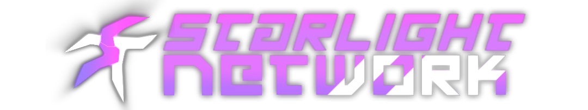
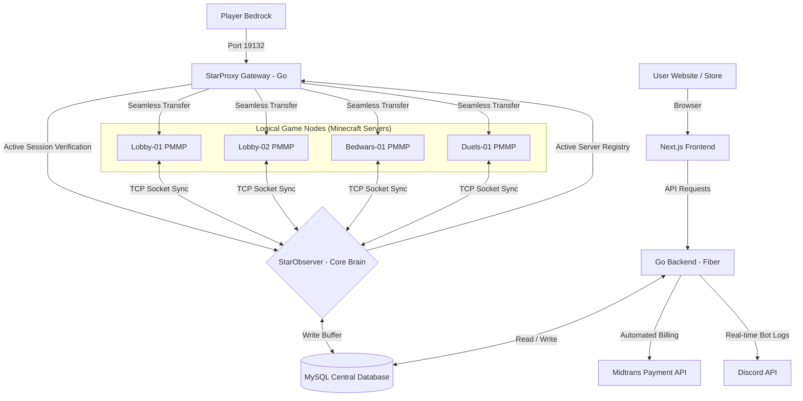

# 🌌 STARLIGHT NETWORK (STARLIGHT-NETWORK-ID)
### *Next-Generation High-Performance Minecraft Bedrock Ecosystem*

  <!-- StarLight ST Logo -->
  
  
  <h1>✨ STARLIGHT NETWORK ✨</h1>
  
<i>"Engrave your own star in our endless sky."</i> 💫

  

    
    
    
    
  

---

## 🪐 Overview
Welcome to the official repository hub of **StarLight Network**, high-performance Minecraft Bedrock network. We engineer everything from scratch with a zero-compromise philosophy—prioritizing vibrant modern aesthetics, optimized network routing, and deep database synchronization.

Our network combines a lightning-fast Go-based distributed backend with a highly-tuned PHP game engine, creating a seamless, lag-free gameplay environment for players worldwide.

---

## 🛰️ Distributed Server Architecture
We do not rely on standard out-of-the-box multi-server setups. We design our own gateways and custom network brokers to handle player sessions with absolute integrity:

### 🛰️ Core Modules & Components

#### 🛰️ 1. StarProxy (The Gateway)
Our front-line high-concurrency gateway built on Go. It handles multi-version protocol translations, manages player handshakes, filters malicious packets, and executes smooth camera transition fades when moving players between active nodes.

#### 🧠 2. StarObserver (The Brain)
The persistent state manager of our network. Built in Go, it holds player sessions in a secure in-memory cache and serves as the sole writer to the central MySQL database, completely shielding player ranks, currencies, and statistics from write-conflicts.

#### 🎮 3. Minecraft Servers (The Game Nodes)
Engineered using deeply optimized custom PHP plugins. These instances host our core game modes (Lobbies, Bedwars, Duels, Valorant) and run asynchronously connected tasks that communicate with the central StarObserver via a custom TCP socket protocol.

#### 🌐 4. Website & Store (The Web Ecosystem)
A next-generation web portal themed around a stunning "Dungeon" design. Built with Next.js, it offers integrated community forums, custom account authentication, developer dashboards, and automated store deliveries powered by the Midtrans gateway.

---

## 🎮 Premium Custom Game Engines

### 🛡️ StarBedwars (Next-Gen Strategy Engine)
Our Bedwars mode is fully optimized for tactical competitive play, offering a refined multiplayer experience:
*   **Dynamic Generator Systems**: Gorgeous visual custom item generators designed to float gracefully above resource blocks, providing players with clear battlefield visibility.
*   **Interactive Villager Shop**: A responsive inventory-based merchant interface with instant buy-back confirmation, smooth transaction feedback, and zero click-latency.
*   **Custom Team Mechanics**: Beautiful team color HUD overlays, dynamic team chat isolation, and customized team upgrade systems.
*   **Seamless Teleportation**: Instant transfer logic that relocates players from game lobbies to arena battlegrounds smoothly.

### ⚔️ StarDuels (Advanced Combat Engine)
*   **Grid Arena Manager**: Dynamically loads template arenas in isolated coordinate grids, providing instant match setups with zero memory overhead.
*   **Matchmaking**: Built-in competitive matchmaking queues using a custom Elo ranking algorithm and predictive logic.
*   **AI Battle Bots**: Highly advanced combat training bots simulating human player movements, strafing, and combo techniques.

### 🎯 StarTDM (Tactical Shooter Engine)
*   **Custom HUD Binding**: High-fidelity client-side HUD JSON bindings to display round times, shield status, and kill reports.
*   **Agent Abilities & Spike Engine**: Complete custom game loop representing spike planting/defusing, dynamic character barriers, and real-time Unicode bossbars.
*   **Tab Grid Statistics**: Dynamic scoreboard grid capturing player combat scores, KDA ratios, and economy stats.

---

## 🎨 Visual Identity & Styling Systems
We believe a great game server must look premium, modern, and distinct:
*   **Custom Scoreboard & UI Typography**: A custom scoreboard rendering system using our high-fidelity bitmap font to deliver a clean, space-morphic sidebar while keeping standard in-game text, names, and inventory lists clean and original.
*   **Custom Ranks & Unicode Icons**: Elegant chat prefixes, custom ranks, and interactive HUD icons that scale perfectly with default Minecraft text sizes, creating a consistent visual layout.
*   **Stunning 3D Wing Cosmetics**: Breathtaking double-sided custom cosmetic wings (such as our signature Snowflake Wings) designed with advanced alpha-test transparency to render flawlessly on modern Bedrock engines.
*   **Custom Form UI & Layouts**: Custom-slotted, fluid form menus featuring floating header animations and responsive layout designs that give the interface a living, dynamic feel.

---

## 🛠️ The Technology Stack

### 💻 Backend Development
| Technology | Purpose | Badge |
| :--- | :--- | :--- |
| **Go (Golang)** | High-concurrency network servers, web api, & observer services |  |
| **PHP 8.2+** | PocketMine-MP plugin logic & game loops |  |

### 🌐 Frontend & Web
| Technology | Purpose | Badge |
| :--- | :--- | :--- |
| **Next.js** | Core Portal, Store, & Community Forums |  |
| **React** | Interactive UI state & web components |  |
| **TailwindCSS** | High-fidelity responsive web styling |  |
| **TypeScript** | Strongly-typed frontend codebase |  |

### 🗄️ Databases & Caching
| Database | Purpose | Badge |
| :--- | :--- | :--- |
| **MySQL / MariaDB** | Persistent storage for users, ranks, and purchases |  |
| **Redis** | High-speed global session caching & Pub/Sub chat |  |

---

## 👥 Founders & Core Developers
The duo behind the vision, design, and execution of StarLight Network:

<table align="center">
  <tr>
    <td align="center" width="50%">
      <a href="https://github.com/ClaudyRg">
         
        <b>Claudy</b>
      </a> 
      👑 <b>Lead Developer & Architect</b> 
      <i>Lead architect in charge of core network systems, high-concurrency game nodes, web applications, and backend database integrations.</i>
    </td>
    <td align="center" width="50%">
      <a href="https://github.com/Kwacyy">
         
        <b>Kwacyy</b>
      </a> 
      🌸 <b>Co-Developer & Interface Designer</b> 
      <i>Creative designer managing custom asset styling, fluid in-game UI menus, and elegant web interfaces.</i>
    </td>
  </tr>
</table>

---

## 📬 Connect With Us
*   **Website**: *Coming Soon*
*   **Discord Server**: *Coming Soon*
*   **IP Address**: *Coming Soon*

  

